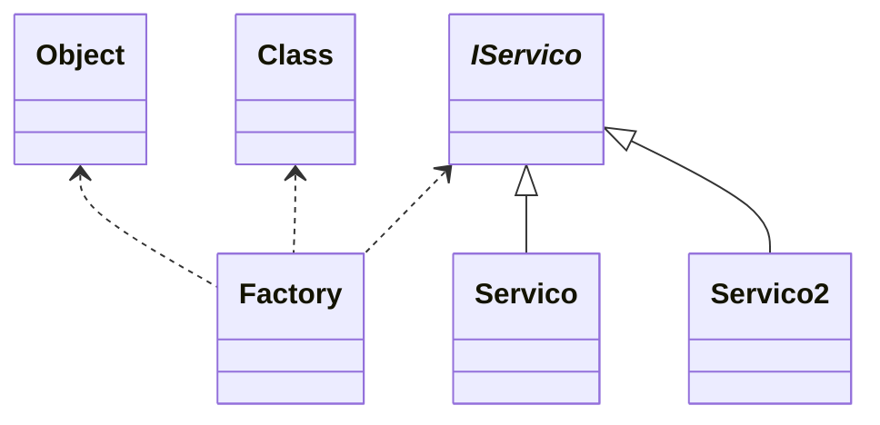

# Factory Method

```mermaid
classDiagram
  class _IServico_
  class Class
  class Object
  class Factory
  class Servico
  class Servico2

_IServico_ <.. Factory
Object <.. Factory
Class <.. Factory
_IServico_ <|-- Servico
_IServico_ <|-- Servico2
```

### Explicação
