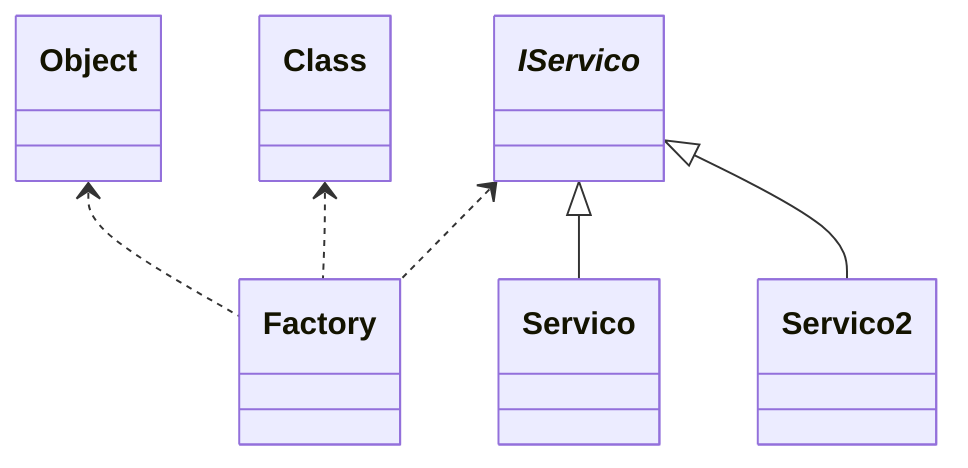
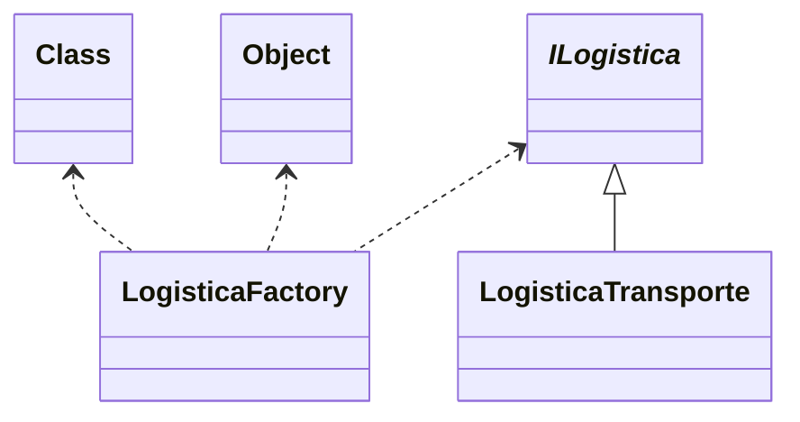

# Factory Method

### **Explicação do Diagrama Factory Method**  

- **`_IServico_`**:  
  - Representa a **interface ou classe abstrata** dos produtos que serão criados pela fábrica.  
  - Define um contrato comum para todas as implementações concretas.  

- **`Servico` e `Servico2`**:  
  - São classes concretas que **herdam (`<|--`) de `_IServico_`**, ou seja, implementam a interface definida.  
  - Representam diferentes tipos de serviços que podem ser criados.  

- **`Factory`**:  
  - Responsável por **criar instâncias de `_IServico_`**, mas sem especificar qual implementação concreta.  
  - Usa **polimorfismo** para retornar instâncias de `Servico` ou `Servico2`, garantindo flexibilidade.  
  - A seta **`<.. _IServico_`** indica que a fábrica retorna objetos que seguem essa interface.  
  - Também está associada a `Class` e `Object`, possivelmente para representar a **criação dinâmica de classes** ou o uso de **reflexão/metaprogramação**.  

### **Como esse modelo representa o Factory Method?**  

1. A **classe `Factory`** encapsula a lógica de criação, garantindo que o código cliente **não precise instanciar objetos diretamente**.  
2. A **interface `_IServico_`** garante que todas as implementações concretas (como `Servico` e `Servico2`) sigam um contrato comum.  
3. Se um novo tipo de serviço for necessário, basta criar uma nova classe que herde de `_IServico_`, sem modificar o código da fábrica (**princípio OCP - Aberto/Fechado**).  
4. O uso de `Class` e `Object` sugere uma possível implementação onde a fábrica pode criar objetos dinamicamente com **reflexão** ou **metaprogramação**.  

Esse diagrama representa bem o **Factory Method**, garantindo que a criação de objetos seja **desacoplada** do código cliente e facilitando a extensão do sistema.

### Diagrama do Código Exemplo

