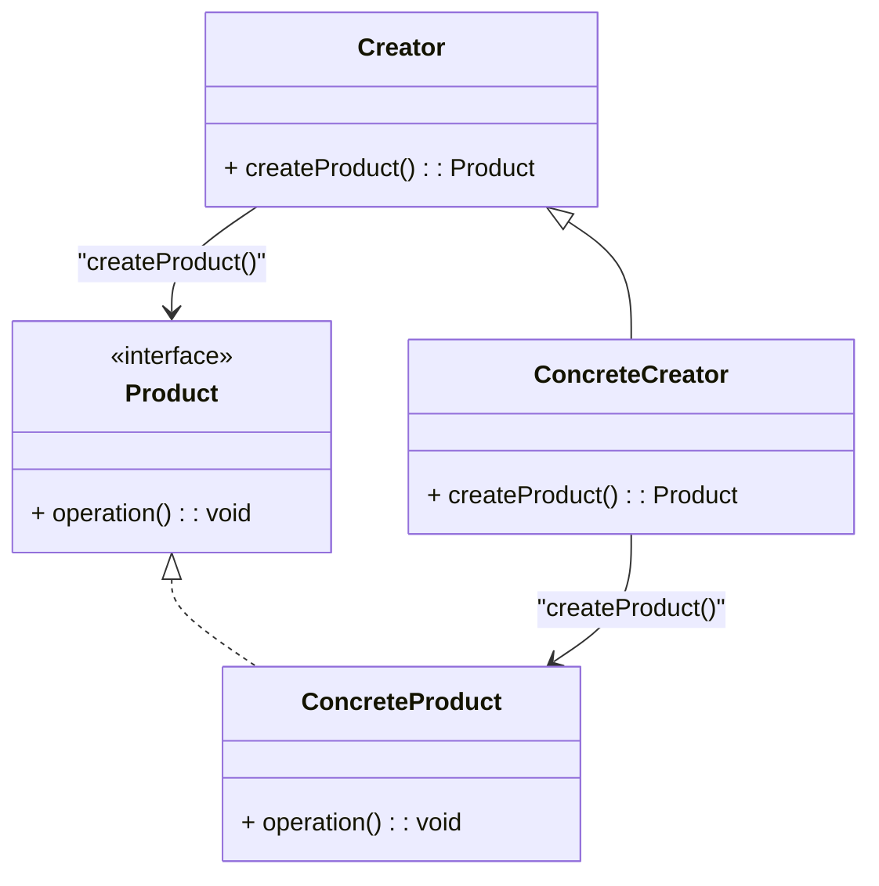

# Factory Method

### Explicação:
- **`Creator`**: Classe abstrata que declara o método `createProduct()`, retornando um objeto do tipo `Product`.
- **`ConcreteCreator`**: Implementa `createProduct()` e retorna um objeto concreto (`ConcreteProduct`).
- **`Product`**: Interface ou classe abstrata representando o produto a ser criado.
- **`ConcreteProduct`**: Implementação concreta da interface `Product`.
- **Setas:**
  - `Creator <|-- ConcreteCreator` → **Herança** (ConcreteCreator herda Creator).
  - `Product <|.. ConcreteProduct` → **Implementação** (ConcreteProduct implementa Product).
  - `Creator --> Product : "createProduct()"` → **Método Factory retornando Product**.
  - `ConcreteCreator --> ConcreteProduct : "createProduct()"` → **Retorna uma instância específica**.

Esse diagrama representa a estrutura do **Factory Method**, onde a **fábrica define um método abstrato** (`createProduct`) e suas subclasses determinam **qual produto concreto** será criado.
